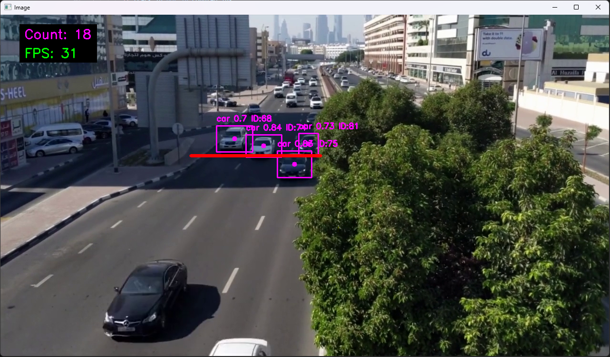
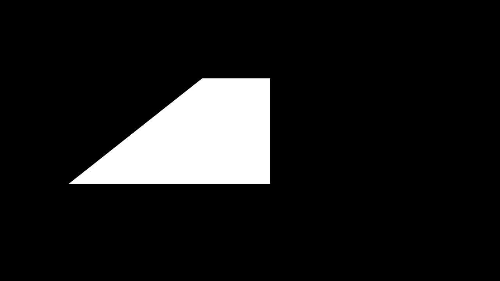

# Vehicle Counter with YOLO and GPU Acceleration

A real-time vehicle detection and counting system using YOLO11 (YOLOv11) with NVIDIA CUDA and cuDNN GPU acceleration. This project tracks and counts vehicles (cars, trucks, buses, motorcycles, motorbikes, and bicycles) as they cross a designated counting line.



## Features

- 🚗 **Multi-vehicle Detection**: Detects cars, trucks, buses, motorcycles, motorbikes, and bicycles
- 🎯 **Object Tracking**: Uses ByteTrack for persistent vehicle tracking across frames
- 🖼️ **Region Masking**: Custom mask to prevent detection of objects outside the region of interest
- 📊 **Real-time Counting**: Counts vehicles as they cross a designated counting line
- ⚡ **GPU Acceleration**: Leverages NVIDIA CUDA and cuDNN for fast inference
- 📈 **Performance Metrics**: Displays FPS and vehicle count in real-time
- 🎨 **Visual Feedback**: Color-coded bounding boxes, tracking IDs, and dynamic line color changes

## Requirements

### Hardware
- NVIDIA GPU with CUDA support
- CUDA-compatible GPU (tested with CUDA 13.0)
- Studio Drivers for GPU

### Software
- Python 3.8+ (ideally go 1-2 versions back for stability)
- PyTorch with CUDA support
- NVIDIA CUDA Toolkit
- cuDNN library

## Installation

1. **Clone the repository** (or navigate to the project directory):
   ```bash
   cd car-counter
   ```

2. **Create a virtual environment** (recommended):
   ```bash
   python -m venv venv
   ```

3. **Activate the virtual environment**:
   - Windows:
     ```bash
     venv\Scripts\activate
     ```
   - Linux/Mac:
     ```bash
     source venv/bin/activate
     ```

4. **Install NVIDIA CUDA Toolkit and cuDNN**:
   - **CUDA Toolkit**: Download and install from [NVIDIA CUDA Toolkit](https://developer.nvidia.com/cuda-downloads) based on your system
   - **cuDNN**: Download from [NVIDIA cuDNN](https://developer.nvidia.com/cudnn)
     - **Important**: cuDNN installation involves manually transferring files to your CUDA installation directory (not a standard installer)
     - It's recommended to **watch a video tutorial** for cuDNN installation as the process can be confusing

5. **Install PyTorch with CUDA support**:
   - ⚠️ **Do NOT use** `pip install torch` as it installs CPU-only version
   - Visit [PyTorch Installation](https://pytorch.org/get-started/locally/) and select:
     - Your OS (Windows/Linux/Mac)
     - Package manager (pip/conda)
     - Python version
     - **CUDA version** (must match your installed CUDA Toolkit version)
   - Copy and run the provided command, for example:
     ```bash
     pip3 install torch torchvision torchaudio --index-url https://download.pytorch.org/whl/cu130
     ```

6. **Install other dependencies**:
   ```bash
   pip install -r requirements.txt
   ```

7. **Verify GPU setup**:
   ```bash
   python gpu_test.py
   ```
   This should output:
   - `True` if CUDA is available
   - Your GPU name
   - CUDA version

8. **Download YOLO weights**:
   - The project uses `yolo11l.pt` which should be placed in the `Yolo-Weights/` directory
   - Weights are automatically downloaded on first run if not present

## Usage

1. **Prepare your video**:
   - Place your video file in the `videos/` directory
   - Update the video path in `car_counter.py` if needed (default: `./videos/cars.mp4`)

2. **Configure the mask**:
   - The `mask.png` file defines the detection region
   - White areas allow detection, black areas are masked out
   - Adjust `mask.png` to match your video's region of interest

   

3. **Set the counting line**:
   - Edit the `limits` variable in `car_counter.py`:
     ```python
     limits = [x1, y1, x2, y2]  # Line coordinates
     ```
   - The red line indicates where vehicles will be counted

4. **Run the detector**:
   ```bash
   python car_counter.py
   ```

5. **Controls**:
   - Press `q` or close the window to exit
   - The counter increments when a vehicle's center point crosses the counting line

## How It Works

1. **Video Input**: Reads frames from the input video
2. **Region Masking**: Applies a mask to focus detection on the region of interest
3. **Object Detection**: YOLO11 model detects vehicles in the masked region
4. **Object Tracking**: ByteTrack assigns unique IDs to each detected vehicle
5. **Line Crossing Detection**: Monitors when vehicle center points cross the counting line
6. **Counting**: Increments counter when a new vehicle ID crosses the line (prevents double-counting)
7. **Visualization**: Displays bounding boxes, labels, tracking IDs, and count

## Configuration

### Adjustable Parameters

- **Confidence Threshold**: Currently set to 0.30 (line 59)
  ```python
  if class_name in allowed_classes and conf>0.30:
  ```

- **Allowed Vehicle Classes**: Modify the `allowed_classes` list (line 21)
  ```python
  allowed_classes = ["car", "truck", "bus", "motorcycle", "motorbike", "bicycle"]
  ```

- **Counting Line**: Adjust the `limits` variable (line 27)
  ```python
  limits = [400, 297, 673, 297]  # [x1, y1, x2, y2]
  ```

- **Line Crossing Tolerance**: Currently ±20 pixels (line 83)
  ```python
  if limits[0] <cx< limits[2] and limits[1]-20 < cy < limits[1]+20:
  ```

- **YOLO Model**: Change the model file (line 18)
  ```python
  model = YOLO("./Yolo-Weights/yolo11l.pt")  # Options: yolo11n.pt, yolo11s.pt, yolo11m.pt, yolo11l.pt, yolo11x.pt
  ```

## Performance

- **GPU Acceleration**: Significantly faster inference compared to CPU-only mode
- **Real-time Processing**: Capable of processing video at 30+ FPS (depending on GPU)
- **Memory Efficient**: Uses ByteTrack for efficient multi-object tracking

## Troubleshooting

### CUDA Not Available
- Ensure NVIDIA drivers are installed
- Verify CUDA toolkit is properly installed
- Check PyTorch CUDA installation: `python -c "import torch; print(torch.cuda.is_available())"`

### Low FPS
- Use a smaller YOLO model (e.g., `yolo11n.pt` instead of `yolo11l.pt`)
- Reduce video resolution
- Ensure GPU is being used (check console output on startup)

### Detection Issues
- Adjust confidence threshold
- Update mask.png to better match your video
- Verify counting line coordinates match your video dimensions

## License

This project is open source and available for personal and educational use.

## Acknowledgments

- [Ultralytics YOLO](https://github.com/ultralytics/ultralytics) for the YOLO11 implementation
- [ByteTrack](https://github.com/ifzhang/ByteTrack) for multi-object tracking
- OpenCV for computer vision utilities
